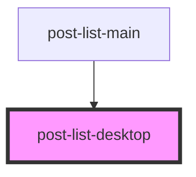

# post-list-desktop

<!-- Auto Generated Below -->

## Properties

| Property   | Attribute   | Description | Type       | Default      |
| ---------- | ----------- | ----------- | ---------- | ------------ |
| `data`     | --          |             | `string[]` | `undefined`  |
| `image`    | `image`     |             | `string`   | `undefined`  |
| `imageAss` | `image-ass` |             | `string`   | `"test.jpg"` |
| `type`     | `type`      |             | `string`   | `undefined`  |

## Dependencies

### Used by

 - [post-list-main](../post-list-main)

### Graph

----------------------------------------------

*Built with [StencilJS](https://stenciljs.com/)*
